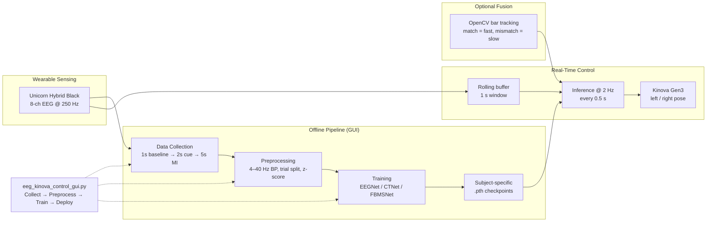

# Fig. 1 — System Architecture (IEEE BSN Paper)

Use this Mermaid diagram for slides, thesis, or to redraw in PowerPoint/Draw.io.
The LaTeX/TikZ version for the paper is in `fig1_system_architecture.tex`.

## Component map (code files)

| Block | File |
|---|---|
| Data collection | `dataCollection.py` |
| Preprocessing | `preprocessing_3_class_EEGNet.ipynb`, `_CTNet.ipynb`, `_FBMSNet.ipynb` |
| Training | `EEGNet_new_training.py`, `ctnet_training.py`, `FBMSNet/train_custom_fbmsnet_updated.py` |
| Real-time inference | `real_time_eeg_predictor.py` |
| EEG-only control | `kinova_eeg_controller.py` |
| EEG + vision hybrid | `kinova_eeg_opencv_controller.py` |
| Unified GUI | `eeg_kinova_control_gui.py` |

## Timing summary

| Parameter | Value |
|---|---|
| Sampling rate | 250 Hz |
| MI phase (offline) | 5 s (1250 samples) |
| Real-time window | 1 s (250 samples) |
| Prediction rate | 0.5 s (2 Hz) |
| Trials per class | 20 |
